```{r setup, include=FALSE}
knitr::opts_chunk$set(echo = FALSE, fig.align = "center", out.width = "640px")
```

# IC-7300

This set-up uses a single USB cable from the IC-7300 to the RigPi.

## IC-7300 parameters

Here are screenshots of all the relevant IC-7300 parameters.

### Connectors parameters

```{r}
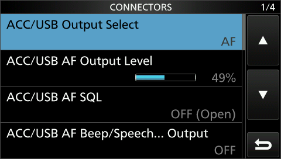
```

```{r}
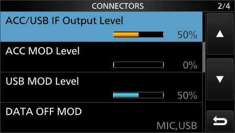
```

```{r}
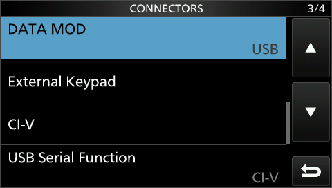
```

```{r}
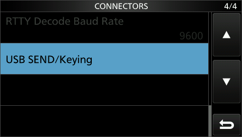
```

### CI-V parameters

From the `CONNECTORS` menu page 3/4 select the `CI-V` submenu.

```{r}
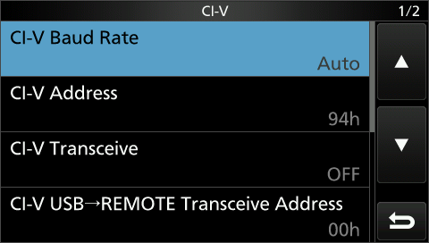
```

```{r}
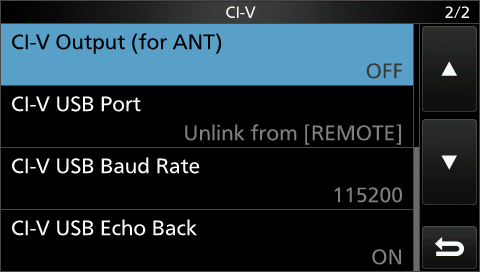
```

### USB Send/Keying Parameters

From the `CONNECTORS` menu page 4/4, select the `USB SEND/Keying` submenu.

```{r}
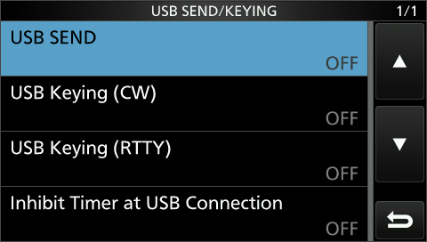
```

## RigPi

### Desktop audio output

```{r}
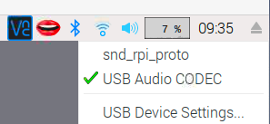
```

### System Audio Device Settings

Click on the Raspberry icon, Select the `Preferences` menu, and the `Audio Device Settings` submenu.

```{r}
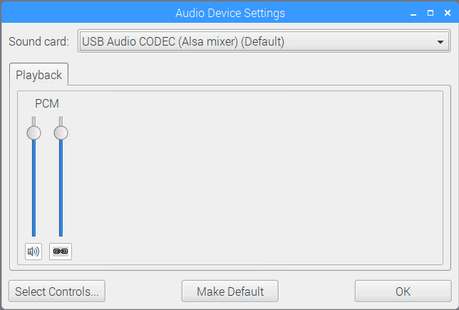
```

### Mumble (1.2.18-1) settings.

Select the `Configure` menu and the `Settings` option.

```{r}
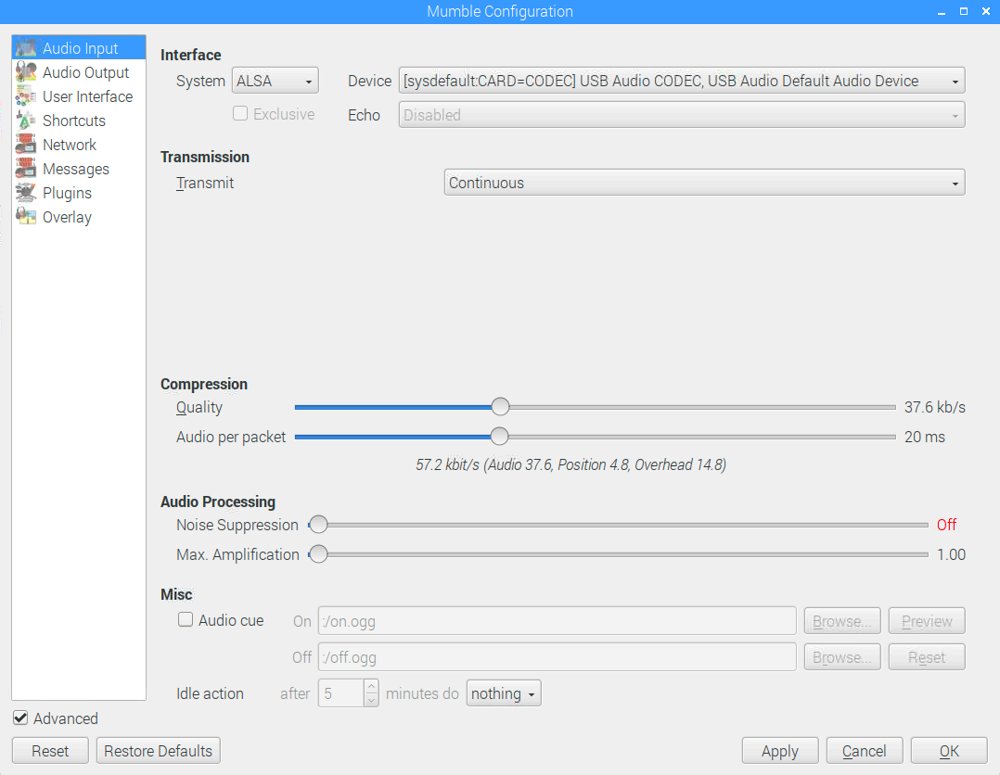
```

```{r}
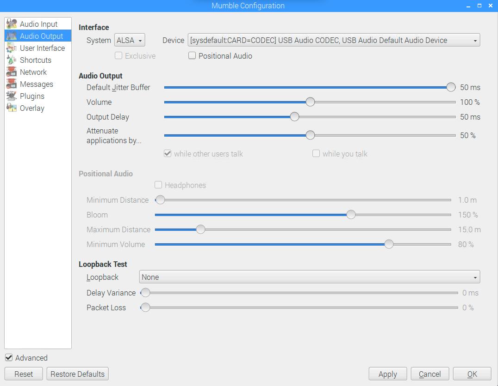
```

Note that both the input and output tabs use the USB Audio CODEC.
I found this to work more consistently.

## Digital mode software

### WSJT-X

#### Update WSJT-X

I downloaded to the Pi a more recent version of WSJT-X (v2.1.2) for Raspbian Stretch from:

<https://physics.princeton.edu/pulsar/K1JT/wsjtx_2.1.2_armhf.deb>

The browser asked what to do after the file downloaded, and I had it open the file.
This launched an installer program.

#### Configure WSJT-X

You may skip the upgrade step if you wish.
In either case, you must configure WSJT-X.

1. Turn the Mumble Server off

You must turn the Mumble server off to avoid having two programs access the same USB audio stream.

From the Mumble window, select the `Server` menu `Disconnect` item.

When the Mumble server is off, the 'lips' icon on the menu bar will turn into a black & white 'headphones' icon.

2. Connect to the RigPi station server via `http://rigpi.local`.

You can connect via a remote device or from the RigPi desktop itself.

3. Connect to the IC-7300 from the RigPi web client.

You may want to do this at the radio to make sure that USB-D mode is selected and that you are on a standard WSTJ-X frequency, e.g., 7.070 MHz.

4. Open WSJT-X

If the program opens, you're in great shape.
If it does not, you will have to say "Ok" to the warning window so that you can modify the settings.

5. Configure settings

From the `File` menu select `Settings`.

Complete the `General` tab with your station information and related settings.

In the `Radio` tab, confirm that you have the setting indicated in this figure.

```{r}
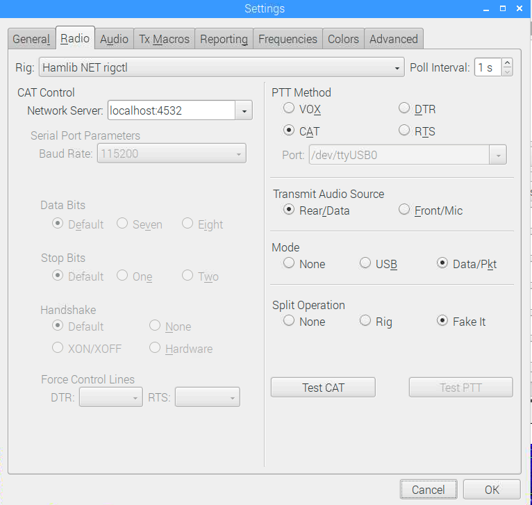
```

I had to deselect the `Hamlib NET rigctrl` as the rig, and choose IC-7300, in order to edit the settings. 
Specifically, I manually set `Serial Port Parameters/Baud Rate` to `115200`.
Then, I reselecte `Hamlib NET rigctrl` from the Rig menu.

Note that on the right side of this `Radio` panel you should select `CAT` for `PTT Method`, `Rear/Data` for `Transmit Audio Source`, and `Data/Pkt` for `Mode`.

Under the `Audio` tab, make sure to select the USB audio CODEC for the Soundcard inputs and outputs.

```{r}
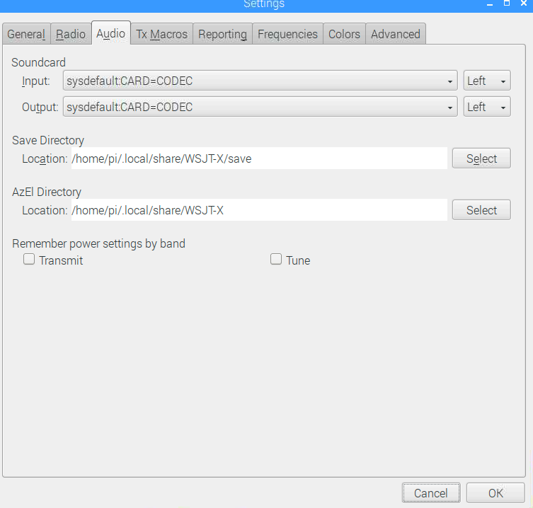
```

Set the other Settings options as you prefer.

Hit `OK` to save.
I suggest quitting WSTJ-X at this point.

6. Restart WSJT-X

When you restart WSJT-X, you should see something like this:

```{r}
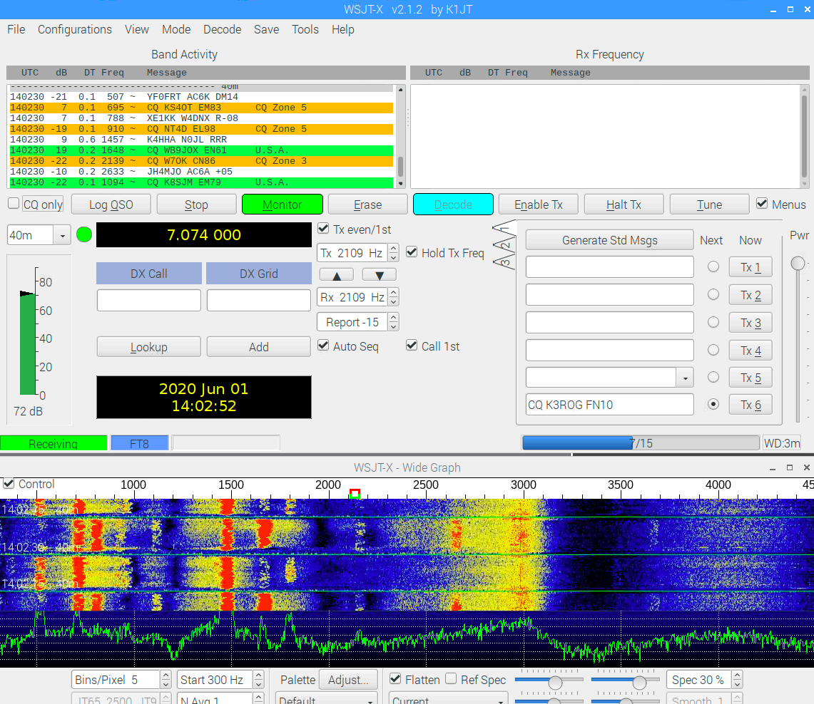
```

#### Troubleshooting

I found the following steps helpful in troubleshooting:

1. Disconnect the RigPi station server.
2. Reboot the Pi.
3. Confirm the audio settings persisted over the reboot.
4. Disconnect the Mumble server. Note if you plan to use the RigPi mostly for digital modes, you can launch the `Mumble Autostart` script from the Desktop to have the server *off* by default.

*Then* I restarted WSJT-X.

### fldigi

# IC-7100

I have an IC-7100, and at some point in the future I will document that installation process here.

